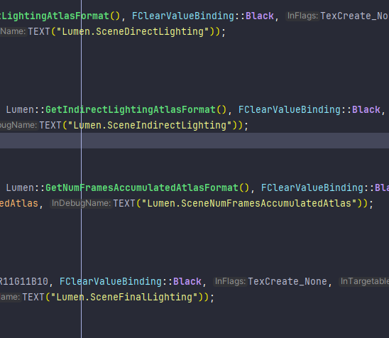

# Lumen（Indirect Diffuse）

**总览**

# 加速结构

Lumen里面用到的比较普遍的加速结构有三种，Hi-Z、MDF和GDF。

Hi-Z准确度最高，但却是三种加速结构里面最慢的一种，一般用于屏幕空间Ray Trace。

MDF准确度较高，速度中等，一般在ray即将到达object需要获取物体表面的Lighting Cache时使用。

GDF准确度较低，但拥有最快的tracing速度，GDF由多个低分辨率MDF通过一定计算得出的，GDF用于长距离的ray trace或者是远处物体（相对于屏幕）的ray trace。

UE加速方案如下

1. 先用Screen Space Trace。基于Hi-Z走50步，如果能Trace到，直接获取结果。
2. 如果Screen Space Trace失败，采用MDF，SDF Trace的距离为1.8米，Trace距离短，也就是只能Trace很近的物体，如果能Trace到返回Mesh ID，可以通过ID获取Surface Cache。
3. 远处物体用GDF，如果需要高精度，先用GDF步进到一定距离再用MDF，如果精度低，直接用GDF一步到位获取结果。
4. 如果GDF也失败了，从CubeMap采样。

UE一般混用这几中加速方案

## Hi-Z

## SDF

### MDF和GDF（Mesh&Global Distance Field）

Lumen混合使用了SDFGI，也就是基于MDF和SDF的Marching，混合的SDFGI对大世界复杂场景有着更高的效率和兼容性，因为在大世界物体非常多，我们不可能对每个MDF都遍历一遍，所以做Ray Marching必须要场景管理，通常的BVH或者是八叉树在GPU中可以起到加速的作用，但往往会因为树的深度不一或者是BVH和八叉树的不规则性导致负载平衡的问题，也就是某些线程处理的任务较多但其他线程处于空闲的状态，这会导致GPU并行性较差。

Lumen采取了MDF和GDF混合的巧妙方法来解决GPU并行性问题，在离相机非常近的物体采用MDF来做Ray Marchintg，由于相机附近场景范围比较小，所以采用了均匀网格这种对GPU并行友好的方式管理MDF。如果MDF没有Hit物体，则使用GDF来对远处的物体进行Ray Marching，GDF是由MDF合成的全局的SDF，不需要遍历速度非常快，而远处物体对近处Pixel的影响其实不会特别大，所以精度也不需要很高，MDF和GDF结合的办法大大加速了Ray Marching的速度。

### SDF能干什么

1. SDF就能加速ray求交

每次步进SDF的距离，可以以log2的代价对光线快速求教，如下面右图。

2. SDF可以快速模拟软阴影

我们可以通过SDF过程中产生的最小角度来模拟光照的最大通量，如下图黄圈，黄圈p3的角度最小，可以近似理解为光能通过这条光路照到o点的覆盖角度只有Θ_3度。

### MDF（Mesh Distance Fields）

#### MDF原理

UE里面每导入一个Mesh都生成对应的个Mesh Distance Fields，MDF代表对应点到Mesh表面最短的距离，通过这个距离我们可以以log2的代价快速对ray求交。

MDF一般在Mesh Card导入的时候就预计算生成了，因为MDF一般是相对于Mesh本身，而Mesh基本又不会形变，所以MDF一般都不变的。

生成MDF的时候需要一定的偏移修正，不然会丢失精度

计算SDF选择的位置都是一系列离散的点，如果有些物体太薄了，SDF的间距都要比物体厚，这样生成的SDF就永远不会为0或者是负数，这时如果用SDF做Ray Marching，在接近物体表面的时候由于找到的所有点都是正数，所以Ray一定会击穿物体，所以这就会导致漏光，同时通过梯度计算的法线也会出错。

#### 如何生成MDF？

因为SDF显存占用过高，所以对SDF进行稀疏化处理，在生成MDF的时候只生成很薄的一层SDF，这样可以节省存储量。

#### MDF LOD

SDF可以做LOD，同时LOD是空间上连续可导的，可以用LOD反向求梯度，也就是说我们用了一个 Uniform 的表达，可以表达出一个无限精度的一个 Mesh ，我既能得到它的面积，又能对它进行快速的求交运算，还能够迅速的求出它连续的这个法线方向。

LOD和稀疏SDF可以节省40%到60%的空间，对于远处的物体我们可以用Low SDF，近处的物体再用High SDF，这样可以很好的控制内存消耗。

为了节省内存和传输的带宽，一般不同LOD的Mesh SDF都会存在同一张Page Atlas里面，这样紧凑的布局可以最大程度的提高效率

Mesh SDF的数据通过一个简单的线性分配器来管理，所有的数据都存储在一个固定大小的池子里，且并不是所有的Mesh SDF的数据都传入显存中，一般情形下，只加载200米以内的Mesh SDF数据，这些数据通过流式加载进GPU，每次只更新需要的Mesh SDF，不需要的就删除掉，这样所有需要用到的SDF数据紧凑的排布在内存池内，可以避免数据碎片化带来的内存浪费。

### GDF（Global Distance Fields）

#### 为什么需要GDF？

如果只用给MDF去做Ray Trace速度会很快，精确度也很高，但是如果Mesh特别多的时候，因为MDF只有薄薄一层的SDF，所以远处的ray需要对每个Mesh生成一个SDF再判断哪个SDF最小再使用，这样就需要遍历很多Mesh的MDF，非常耗费性能，所以提出了GDF的概念。

详细来说其实是GDF和MDF结合的方式，上面的场景每个Pixel都有非常多的网格，这种情况用BVH或者八叉树能够提升Ray Marching效率，但尽管如此，同一个包围盒里面还是会有非常多的物体，包围盒遍历的物体数量不同带来的负载平和和树的深度不一致也会打断GPU的并行，所以UE采用了近处的物体的Mesh SDF直接用均匀网格的方式进行划分，如果没找到近处的Mesh SDF，则采用GDF进行远距离的步进。

#### GDF原理 

GDF是整个场景的SDF，通常GDF的精度都比较低，低精度的GDF是通过场景中每个MDF共同合成的。

GDF可视化

MDF可视化

因为GDF代表的是远处没那么高精度的场景，所以我们可以采用Low LOD的MDF去合成，完整的MDF可以用于整个场景的SDF求交加速，比较常用的方法是先用GDF快速Trace一大段距离，再用MDF去做精细的求交。

GDF一般需要实时生成，因为GDF相对于世界空间，而世界空间里面物体随时可能变换位置，所以GDF需要实时生成。

#### GDF的更新

把场景中所有的Mesh SDF合并成GDF是非常消耗时间的过程，如果对每个MDF都遍历一次，这是承受不起的，UE采用了设置ClipMap的LOD和把静态物体和动态物体分开更新两种优化大大加速了GDF的更新。

UE为每个ClipMap设置了单独的LOD，越远的场景越粗糙，这样相当丢弃了远处较小对象的实例，越远的ClipMap需要合并的实例就越少。

而较近的物体分成静态和动态，通常场景中只有少数物体在移动，所以只需要找到那一小部分在移动的物体所在的bricks并用容器将brkcks记录下来，形成一个类似于Mask的区域，只需要更新这个区域里面的距离场便可以

# Mesh Card

## 为什么需要用Mesh Card

SDF已经大大加速了Ray Marching，但是SDF只存空间中的点到物体的最近距离，也就是这时只有HIt Point的Positon，没办法获取到Material信息，没有材质自然也就无法计算光照，因此我们需要一种结构，在SDF获取到Hit Point的同时也能找到对应的Material。

MeshCard便是这种数据结构，他不仅能够在获取到Hit Positon，还能通过Hit Positon映射到Mesh Card对应的位置获取Surface Cache和Radiance Cache。

## MeshCard细节

Mesh Card是一种结构的统称，在Lumens里面，我们每个导入的物体都会离线生成一套Mesh Card。Mesh Card 是Mesh的一种属性结构，用于记录数据。要注意的是，MeshCard同时包含Surface Cache和Radiance Cache，Material属性一般都不会改变，所以在离线生成Mesh Card1的时候一般都会直接写入Surface Cache数据，但Radiance会每帧变化，所以每帧都会选择部分需要更新的Mesh Card更新Radiance Cache。

UE里面捕获Mesh Card的方式是通过对6个轴对齐方向（上、下、左、右、前、后）进行光栅化，获取Mesh对应的材质中的Material Attributes（Albedo、Opacity、Normal、Emissive）并存储到Surface Cache上，同时需要捕获的还有对应观察角度的Hit Point，每个面的Hit Point数据需要进行物理地址转换到Surface Cache图集空间中执行采样。

每个Mesh至少有6个Card，复杂物体可能会生成多个。

Mesh Card用于记录Material的Attribute和Lighting的Radiance，我们把这两种数据分为Surface Cache和Radiance Cache，而我们最后把数据存入Mesh Card里面。

## Card LOD

大世界中往往存在很多的Mesh，对每个Mesh都进行细致的光栅化是不切实际的，所以对于远距离的Mesh一般采用Card LOD，也就是远处物体不需要生成那么多Card，往往6-8个足够了，这样可以减少光栅化的次数。

每个 Mesh 的每个 LOD 最多可以有 32 个 Card。

## Surface Cache

Surface Cache受摄像机距离影响，相机离物体比较近的时候Surface Cache分辨率会高一点。

Surface Cache内的Material属性一般都会经过硬件压缩来减少显存的占用

Surface Cache属性通常类似于GBuffer的属性，在导入模型的时候就预加载进Surface Cache里面了，Material属性是Surface Cache里面基本不变的数据

对于较远的物体，在光栅化记录Surface Cache中Material Attribute的时候，可以采用更低分辨率进一步减少光栅化和存储，这就是Surface Mipmap。与传统 Mipmap 存储方式不同，Surface Mipmap 在 Surface Cache 平铺展开存储，因此在采样时需要额外的地址转换。

下面左右分别是同一个Mesh的不同Mipmap

### Surface Cache资源管理

#### Card Atlas

Lumen通过Lumen.SceneXXX来存储Material Cache和Radiance Cache，**这种数据结构叫Card Atlas**。

Material Cache对应的RDG资源名称为

- Lumen.SceneAlbedo
- Lumen.SceneOpacity
- Lumen.SceneDepth
- Lumen.SceneNormal
- Lumen.SceneEmissive

Radiance Cache对应的资源名称为

- Lumen.SceneDirectLighting
- Lumen.SceneIndirectLighting
- Lumen.SceneNumFramesAccumulatedAtlas
- Lumen.SceneFinalLighting

#### Card Capture Atlas

需要一提的是，Lumen通过光栅化对Mesh六个面的进行capture后，会把对应的Albedl、Normal、Emissive、Depth分别存储在四张大型的Render Target上，这就把所有的Mesh的Material Attribute都打包到一起了，存储在一个大图集上（Atlas），**这个Atlas 被称为Card Capture Atlas**，这么做可以降低RT交换的损耗。

上面的Card Capture Atlas只是一个临时结构，最终会通过一个叫CopyCardsToSurfaceCache的Pass将Card Capture Atlas的数据Copy到Card Atlas上。

#### Card Atlas的存储

为了保证Card Atlas有足够的空间存储Material Attribute，Lumen中默认每个Card Atlas的大小为4K×4K，共有Depth、Albedo、Opacity、Normal、Emissive五张Atlas。

如果每张贴图32位，共需要320MB显存，这是比较占用空间的，所以Lumen会通过硬件压缩的格式节约资源，

除了Depth之外都用了硬件压缩格式，这是因为需要通过Depth精确还原世界空间的位置以及精确计算Radiance Occlusion，因此不能用有损格式。

## Radiance Cache

Mesh Card不只记录Material（Surface ）的属性，还需要记录光照的Radiance属性，这是为了间接光的复用，我们不可能在相交点发射无数光线去不停的递归计算间接光，所以我们把每一次的光照结果固定下来，Radiance Cache算的是Irradiance。

要注意的是，计算Radiance Cache的方式并不是直接获取Hit Position的Material直接算光照，而是通过下面用临时Probe做分帧计算，最后结果再存进Radiance Cache，Ray打到Hit Point的时候，我们直接取Radiance Cache里的值就行了。这么做的原因是提高光线追踪的并行效率，因为每条光线碰到的Hit Point的材质可能相差很大，很难保证局部性，所以Lumen将Surface的光照解耦，将其分摊到多帧中计算，而这些Radiance Cache可以被后续帧复用。

### 分帧算法

第一帧先把直接光记录到Radiance Cache里面

第二帧以第一帧记录了直接光的Mesh Card作为光源，发射射线去Trace，得到的结果当作下一次的光源

每次得到的结果加上上一帧的结果得到Final Lighting，以此递归，相当于把递归算法拆解到每一帧

如果对每一个Texel都去Trace光线收集Radiance是不现实的，哪怕是分帧，每个Texel都去发射光线还是会造成很大能耗，因为间接光材质默认是Diffues的，所以我们以每16×16为一个单位通过八面体映射的技术用Probe记录Radiance，再转换成SH来降低存储，这样可以大幅度加快实时Trace效率，又因为是低频信号，所以结果也很不错。

## Sort Mesh Cards

Mesh Cards里面的Lighting Cache需要实时更新，但如果对整个Surface Cache都更新的话是十分耗时的，因此Lumen里面规定，每帧最多不超过 1024 x 1024 个texels更新，因此我们就需要对Mesh Cards进行桶排序，大概只有前面10%的Mesh Cards可以被更新。

# Voxel Lighting

Voxel Lighting是采用体素来存储光照，光照分帧累计，最终得到全局光照效果的一种GI方案。

Lumen在运行时将Camera周围一定范围内的Lumen Scene体素化，然后通过对Voxel六个方向分别采样与Voxel相交的Mesh Distance Field，通过获取交点的Surface Cache的Final Lighting的Irradiance作为二次光影，对Voxel对应的那个面做光照注入。

Voxel Lighting分为三步

1. 场景体素化
2. 发射ray采样
3. 光照注入以及更新

## Voxel 生成的优化手段

直接对所有场景和物体进行体素化是不合理的，通常我们只对摄像机视野内可见的物体做体素化，在Lumen里面我们对所有视野范围内的场景进行Clipmap分层，再体素化并用3Dtexture来存储Voxel里的光照，当相机移出视野后，Voxel光照不变，可被下次trace复用。

当摄像机位置改变，Clipmap也会改变，所以如果对所有体素进行更新是不合理的，所以Lumen对ClipMap进行了再分层，用Tile的形式存储Voxel，这样更新等操作都是通过对Tile进行检测并进行，就不需要每帧检测所有提速了，这种方式类似于BVH等的加速结构。

### ClipMap

ClipMap是一种比MipMap存储量更小的存储结构，所有ClipMap 具有相同的分辨率，所以ClipMap也能很好的保留场景的细节，Voxel的生成一般就通过ClipMap生成。

下面是ClipMap和MipMap的对比。

Lumen将Voxel Lighting分为多个Clipmap，默认每个Clipmap里面有64×64×64个Voxel。

第一级Clipmap 0覆盖的区域一般为2500cm，覆盖范围是（25×2）^3立方米，Clipmap一般有四级，每级覆盖的区域都是上一级的两倍。

每个 Clipmap 对应的 Voxel 大小为 Clipmap Size / Clipmap Resolution，例如最细级别的 Clipmap 的 Voxel 大小为：(2500/64) x 2~= 78，即最小可覆盖 0.78^3 立方米的空间。

### Tile

Lumen通过网格化Clipmap的形式生成Tile，一个Tile包含4×4×4的Voxel，又因为每个Clipmap有 64x64x64 个 Voxels，所以每个Clipmap可划分为 16x16x16 个 Tiles。

划分为Tile的目的有两个

1. 在Camera移动的时候可以离散化的更新Clipmap
2. 提供层次化更新机制，有利于提高GPU并行度，获得更好的性能。

### Voxel Visibility Buffer

为了完成采样 Surface Cache 的 Final Lighting，需要知道每个 Voxel 在每个方向上 Trace 到的 Mesh DF 信息，这个信息存储在 Voxel Visibility Buffer 中。与我们熟知的 Visibility Buffer 不同的是，这里存储的内容是 Mesh DF ID 以及归一化的 Hit Distance，在 Injecting Lighting 时就根据这些数据对 Final Lighting 采样。

Lumen 将所有 Clipmap 的 Voxel 的 Visibility 都存储在同一个 Buffer 中，并且 Visibility Buffer 是跨帧持久化的，因此为了性能每帧会按需更新内容。

## Voxel的存储手段

Lumen采用3D Texture的手段存储Voxel各个方向的光照Irradiance，这张3D纹理上的每一个Texel都代表一个Voxel在某个方向上的Lighting。

要注意这边的3D Texture内xyz轴并不是存储对应轴向的光照信息。

在3D Texture内，X轴存的是不同的Voxel，Y轴存的是同一个Voxel不同Clipmap级别的Lighting信息，Z轴存的是同一个Voxel不同的方向，需要3维的信息(Voxel，Direction，Clipmap)才能表示某一个Tiexl的Lighting信息。

## 场景体素化

要体素化场景，我们先找都每个面元在哪个Clipmap上，然后把整个像素的WorldPosition转换成屏幕UV，查询该面元在哪个Voxel范围内，生成对应的体素，同时根据后续算法注入光照，为体素每个面收集Lighting信息。

## 采样

UE采用多种采样策略，通常通过求得体素发射ray到其他体素的交点来得到二次光源的Lighting信息，

## 光照注入及更新

# Scene Dirct Lighting 

# Scene Indirect Lighting（Radiosity）

# Screen Probe Gather

