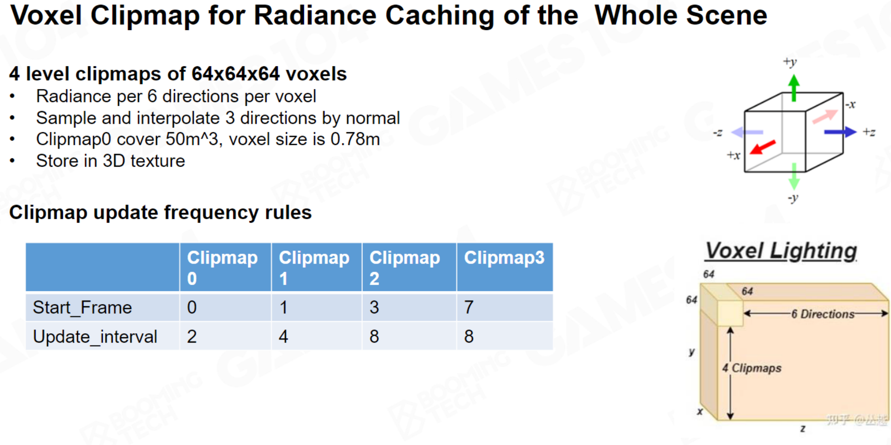

# Lumen（Indirect Diffuse）

**总览**

# 软件光线追踪

UE默认采用软件光线追踪，因为软件光线追踪可以无视平台和硬件的限制带来跟硬件光线追踪质量相近的结果，同时软件光线追踪采用的大量加速结构使得它在很多复杂的场景性能反而比硬件光线追踪高。

## Ray Trace加速结构

Lumen里面软件光追用到的比较普遍的Ray Trace加速结构有三种，Hi-Z、MDF和GDF。

Hi-Z准确度最高，但却是三种加速结构里面最慢的一种，一般用于屏幕空间Ray Trace。

MDF准确度较高，速度中等，一般在ray即将到达object需要获取物体表面的Lighting Cache时使用。

GDF准确度较低，但拥有最快的tracing速度，GDF由多个低分辨率MDF通过一定计算得出的，GDF用于长距离的ray trace或者是远处物体（相对于屏幕）的ray trace。

UE加速方案如下

1. 先用Screen Space Trace。基于Hi-Z走50步，如果能Trace到，直接获取结果。
2. 如果Screen Space Trace失败，采用MDF，SDF Trace的距离为1.8米，Trace距离短，也就是只能Trace很近的物体，如果能Trace到返回Mesh ID，可以通过ID获取Surface Cache。
3. 远处物体用GDF，如果需要高精度，先用GDF步进到一定距离再用MDF，如果精度低，直接用GDF一步到位获取结果。
4. 如果GDF也失败了，从CubeMap采样。

UE一般混用这几中加速方案

### Hi-Z（Hierarchical Z Buffer）

#### Hi-Z原理

Hi-Z是一种屏幕空间的算法，该算法记录一些列屏幕深度的MipMap，越下层的MipMap越精细，每个上层 MipMap里面的一个像素，都对应它下层Mip里面四个点的像素。

有了这种结构，我们可以仅仅通过判断上层粗糙结构与Ray有没有交点就可以直接决定要不要走下层结构的分支了。

#### Hi-Z能做什么？

##### SSGI屏幕空间加速求交

在做SSGI的过程中我们需要沿着Lobe的方向去发射Ray去获取第一个命中点的颜色，收集到这个颜色就可以计算这个颜色对我们要计算的Pixel的贡献了。

而这个过程如何从这么多三角形中找到第一个命中点呢？

最简单的方式就是固定步长步进，Ray每次步进一个固定长度，然后根据屏幕空间深度判断一下这时候的Ray在当前Pixel前还是后，如果Ray位置在Pixel后面说明已经打到该Pixel里某个三角形片段上了。

固定步长的方法虽然能够找到交点，但是速度太慢了，如果步长太小可能要走成千上万步，步长过大击穿太多物体可能会导致找不到第一个交点。

Hi-Z就是一种自适应步长的加速方案，在该方案中，不同级别的深度MipMap记录着该Pixel内所有物体的最浅深度，也就是离屏幕的最近距离，先用较粗糙的深度MipMap做光线求交，如果有交点则说明光线有可能和该Pixel内物体有交点，继续找更精细的MipMap，如果没有交点则代表Ray跟该Pixel内所有物体一定不相交。

该算法适应选择步长的过程有点像篮球里的试探步，一开始先从最低级的MipMap迈出一小步，发现没有打到交点

下一步就可以大胆一点了，向高一级粗糙一点的MipMap迈出一步，高层的MipMap的一步相当于底层MipMap的两个步，发现还是没有打到交点

下一步再大胆一点，在更高级的MipMap再走一步，最后发现和这一级的MipMap有交点了

发现已经有交点以后就不能这么鲁莽的迈一大步了，我们开始缩小步长，回退一级MipMap开始小步迈进

这时发现和这一级的MipMap仍然有交点，我们需要更小心了，再迈更小的步，如果已经是最底层的MipMap我们就保持最小步行进

最后的小布前进成功使我们找到了交点，这种步进的方式其实很类似于二分查找，最终以logn的复杂度远胜固定步长步进。

##### 遮挡剔除

遮挡剔除同样是利用Hi-Z实现类似于二分加速的方案，由于视角的问题，其实场景里有很多物体是看不到的，所以我们可除掉这些看不到的Mesh的提交来减少Draw Call，这个过程就需要用到Hi-Z加速。

遮挡剔除的粒度是整个物体而不是像素，所以一般通过判断包围盒的深度来选择是否要进行剔除，而一个包围盒有的时候是很大的 ，比如我们近距离看一颗草的包围盒，下图草的包围盒覆盖了13*13个像素，我们总共需要判断169次屏幕深度和包围盒深度，哪怕有一次包围盒深度要小于等于屏幕空间深度（包围盒里可能有一小部分要比屏幕深度离相机更近），那就不能剔除掉这个物体，因为只要出现一次这种情况，那就说明这个物体有可能出现在屏幕内被我们看到。

可以用Hi-Z的方式去减少包围盒判断的次数，就比如生成一个更高级的MipMap里面存储低一级MipMap里面四个像素的离相机最远的深度，那么包围盒只要比最远深度还要远那就剔除掉，因为这种情况这个物体一定是不可见的，且我们只需要非常少的判断次数就能得到结果。

通常我们会一直找更高级别的MipMap直到该层级MipMap里面一个像素能完全包裹一个包围盒再做上面的判断，这样就最少一次就可以剔除掉物体了，但UE一般采用的是4×4的判断方式，因为极端情况下，如果包围盒中心恰好在屏幕正中心，而包围盒又占不满那一个Tixel，该包围盒就可能受到Tixel内其他位置的深度影响，本该被剔除却因为这种原因没被剔除，这就会导致遮挡剔除命中率降低。

最后需要考虑的就是实现上的问题了，因为要做剔除就需要知道深度，而深度要绘制了物体才能知道，这就好像是先有鸡还是先有蛋的问题。

为了解决这个问题，研究者们提出了很多Hi-Z遮挡剔除的方案，以下介绍几种

1. 通过一个简单的CPU软光栅化得到一张简单的深度图用来指导Hi-Z做遮挡剔除，但CPU光栅化速度会比较慢。
2. 利用前一帧的ZBuffer重投影后的信息再Compute Shader里指导Hi-Z做遮挡剔除， 这种方法存在两个问题，如果重投影个别像素在上一帧没有对应位置就会导致生成的ZBuffer存在漏洞，这导致高级别的深度MipMap几乎剔除不了任何物体，另一个问题会导致动态物体重投影区域产生延迟且快速移动物周围会产生物体突然出现的我呢提，因为动态物体这帧可见了但是按上一帧判断还是被剔除了。
3. 《刺客信条大革命》提出了第3种方式的优化方案，采用Two Pass的方式，第一个Pass对大概300个occluders做光栅化来获取深度补全上一帧重投影导致的漏洞，通过补全后用上一帧重投影的ZBuffer和这一帧绘制的occluder生成一个尽量贴近当前帧实际情况的zbuffer指导Hi-Z做遮挡剔除，留下的物体存进容器A，被剔除的物体存进容器B，这样可以得到大概率不可被剔除的物体，第一个Pass是非保守Pass，好处是可以根据不是完全准确的ZBuffer得到部分需要保留的物体。第二个Pass绘制上一个Pass得到的A内的物体，然后用算出的ZBuffer信息再对B内的物体做遮挡剔除，第二个Pass目的是采用保守的方式找回第一个Pass错误剔除的物体。
4. UE内不依靠硬件的Hi-Z遮挡剔除通过异步加载上一帧的ZBuffer+爆算部分这一帧的深度，通过这种方式算出来的ZBuffer仍需要回读到CPU里做剔除然后上交Draw Call，这种方式没办法使用GPU-Driven的原因是因为由于材质和物体信息没办法解耦，Texture需要每个Draw Call重新绑定，而通常一个场景有成千上百个Material。
5. UE可通过硬件特性做粒度是像素级的Hardware occlusion query，这种方式会上交一种特殊的Draw Call，这种Draw Call只通过depth test阶段且不会进入PS和blending，这种方法仍然需要回读，但是有一个好处就是不需要根据Material切换PSO，只需要在开始提交occlusion query前设置好一次PSO就行了，这样提交Draw Call速度会非常快。

**这边主要介绍一下Nanite里的Hi-Z遮挡剔除**

UE里针对Nanite 遮挡剔除采用的是类似于《刺客信条大革命》的方式，但它不是用上一帧投影到这一帧，而是把这一帧的物体重投影到上一帧，利用上一帧的Hi-Z做遮挡剔除，这种方法不会出现Hi-Z的漏洞，只会出现部分错误的剔除，第二个Pass再用这张ZBuffer做二次遮挡剔除。

遮挡剔除要遵循的原则是保守性剔除，宁可放过，不可杀错。

### SDF（Signed Distance Field）

#### SDF原理

用SDF做Ray Tracing可以理解为用SDF的值去当做步长来做Ray Marching，形象一点理解就是下图的Sphere tracing，SDF的值代表着这个点到最近Mesh的距离，也就是以这个距离为半径的圆的范围内一定没有物体，以SDF的值去步进可以快速的跳过大范围的空白区域。

哪怕在接近表面的时候因为某些插值过后的SDF导致Ray穿进了物体内部，因为SDF的有符号性，内部的负数也会让Ray回退回去，所以SDF是一种安全且快速的步进方法。

#### MDF和GDF（Mesh&Global Distance Field）

Lumen混合使用了SDFGI，也就是基于MDF和SDF的Marching，混合的SDFGI对大世界复杂场景有着更高的效率和兼容性，因为在大世界物体非常多，我们不可能对每个MDF都遍历一遍，所以做Ray Marching必须要场景管理，通常的BVH或者是八叉树在GPU中可以起到加速的作用，但往往会因为树的深度不一或者是BVH和八叉树的不规则性导致负载平衡的问题，也就是某些线程处理的任务较多但其他线程处于空闲的状态，这会导致GPU并行性较差。

Lumen采取了MDF和GDF混合的巧妙方法来解决GPU并行性问题，在离相机非常近的物体采用MDF来做Ray Marchintg，由于相机附近场景范围比较小，所以采用了均匀网格这种对GPU并行友好的方式管理MDF。如果MDF没有Hit物体，则使用GDF来对远处的物体进行Ray Marching，GDF是由MDF合成的全局的SDF，不需要遍历速度非常快，而远处物体对近处Pixel的影响其实不会特别大，所以精度也不需要很高，MDF和GDF结合的办法大大加速了Ray Marching的速度。

#### SDF能做什么？

##### SDF加速ray求交

每次步进SDF的距离，可以以log2的代价对光线快速求交，同样SDF也能避免左图固定步长带来的Ray穿过薄物体的问题。

##### 快速模拟软阴影

我们可以通过SDF过程中产生的最小角度来模拟光照的最大通量，如下图黄圈，黄圈p3的角度最小，可以近似理解为光能通过这条光路照到o点的覆盖角度只有θ3的度数。

#### MDF（Mesh Distance Fields）

##### MDF原理

UE里面每导入一个Mesh都生成对应的个Mesh Distance Fields，MDF代表对应点到Mesh表面最短的距离，通过这个距离我们可以以log2的代价快速对ray求交。

MDF一般在Mesh Card导入的时候就预计算生成了，因为MDF一般是相对于Mesh本身，而Mesh基本又不会形变，所以MDF一般都不变的。

生成MDF的时候需要一定的偏移修正，不然会丢失精度

计算SDF选择的位置都是一系列离散的点，如果有些物体太薄了，SDF的间距都要比物体厚，这样生成的SDF就永远不会为0或者是负数（**这是因为两个SDF采样点之间的SDF值是插值得来的，两个正数插值还是正数，如上图红点插值后还是5**），这时如果用SDF做Ray Marching，在接近物体表面的时候由于找到的所有点都是正数，所以Ray一定会击穿物体，所以这就会导致漏光，同时通过梯度计算的法线也会出错。

##### 如何生成MDF？

因为SDF显存占用过高，所以对SDF进行稀疏化处理，在生成MDF的时候只生成很薄的一层SDF，这样可以节省存储量。

##### MDF LOD

SDF可以做LOD，同时LOD是空间上连续可导的，可以用LOD反向求梯度，也就是说我们用了一个 Uniform 的表达，可以表达出一个无限精度的一个 Mesh ，我既能得到它的面积，又能对它进行快速的求交运算，还能够迅速的求出它连续的这个法线方向。

LOD和稀疏SDF可以节省40%到60%的空间，对于远处的物体我们可以用Low SDF，近处的物体再用High SDF，这样可以很好的控制内存消耗。

为了节省内存和传输的带宽，一般不同LOD的Mesh SDF都会存在同一张Page Atlas里面，这样紧凑的布局可以最大程度的提高效率

Mesh SDF的数据通过一个简单的线性分配器来管理，所有的数据都存储在一个固定大小的池子里，且并不是所有的Mesh SDF的数据都传入显存中，一般情形下，只加载200米以内的Mesh SDF数据，这些数据通过流式加载进GPU，每次只更新需要的Mesh SDF，不需要的就删除掉，这样所有需要用到的SDF数据紧凑的排布在内存池内，可以避免数据碎片化带来的内存浪费。

#### GDF（Global Distance Fields）

##### 为什么需要GDF？

如果只用给MDF去做Ray Trace速度会很快，精确度也很高，但是如果Mesh特别多的时候，因为MDF只有薄薄一层的SDF，所以远处的ray需要对每个Mesh生成一个SDF再判断哪个SDF最小再使用，这样就需要遍历很多Mesh的MDF，非常耗费性能，所以提出了GDF的概念。

详细来说其实是GDF和MDF结合的方式，上面的场景每个Pixel都有非常多的网格，这种情况用BVH或者八叉树能够提升Ray Marching效率，但尽管如此，同一个包围盒里面还是会有非常多的物体，由于没办法直接知道Trace到的是哪个物体，所以需要遍历大量的物体，而包围盒遍历的物体数量不同带来的负载平和和树的深度不一致也会打断GPU的并行，所以UE采用了近处的物体的Mesh SDF直接用均匀网格的方式进行划分，如果没找到近处的Mesh SDF，则采用GDF进行远距离的步进。

##### GDF原理 

GDF是整个场景的SDF，通常GDF的精度都比较低，低精度的GDF是通过场景中每个MDF共同合成的。

GDF可视化

MDF可视化

因为GDF代表的是远处没那么高精度的场景，所以我们可以采用Low LOD的MDF去合成，完整的MDF可以用于整个场景的SDF求交加速，比较常用的方法是先用GDF快速Trace一大段距离，再用MDF去做精细的求交。

GDF一般需要实时生成，因为GDF相对于世界空间，而世界空间里面物体随时可能变换位置，所以GDF需要实时生成。

##### GDF的更新

把场景中所有的Mesh SDF合并成GDF是非常消耗时间的过程，如果对每个MDF都遍历一次，这是承受不起的，UE采用了动静态物体更新和时间切片更新来减少GDF的不必要的更新。

* 动静态物体更新策略，只更新自上一帧来发生变化的部分

**要注意的一点是，GDF采用的ClipMap存储的策略，所以更新策略是基于世界空间而不是屏幕空间的，也就是转动屏幕并不会导致GDF的更新，只有物体动起来或者世界场景真正变化的时候才会更新。**

动静态物体更新就是只更新发生改变的部分，具体的做法是把物体分为静态和动态两种，静态物体默认不更新，只需要更新被动态物体影响部分的GDF就行了。UE采用了分Brick的策略，这里的Bricks其实可以理解为ClipMap里面对应的世界空间的方形区域，当物体移动的时候，标记这块区域，由此得到需要修改的Brick列表，最后对所有在列表里的Brick进行更新。

找到了要更新的Brick，只需要遍历这个Brick里面的对象，然后计算空间中的点到多个对象的距离最小值就可以得到结果了，注意这里并不是对空间中所有点进行最小距离距离计算，而是采用窄带距离场（Narrow Band Distance Field）的方式只对物体表面很薄一层空间进行SDF计算。

**在更新了每个Brick里面的GDF以后，UE采用了更粗糙的MipMap的方式来标记一整个区域的Brick内的物体，这主要用于后续的Ray March加速。**

* 时间切片的方式来减少远处较小对象的更新频率，为每个ClipMap设置单独的LOD来减少远处物体的GDF更新计算量

UE采用时间切片的方式，对于最精细的ClipMap（离相机最近的）每帧都更新GDF，对于远处的ClipMap采取多帧才更新一次的策略来减少更新次数。

同时每个ClipMap也设置了单独的LOD，越远的场景越粗糙，这样相当丢弃了远处较小对象的实例，越远的ClipMap需要合并的实例就越少。

## Ray March加速结构

上面介绍的Ray Trace加速结构主要用于加速Ray的步进，但Ray不仅需要步进的快，还需要能够快速求交以及获取对应的材质信息，因此我们需要加速Ray March得到Hit Point的过程。

### Hi-Z的Ray March

Hi-Z的Ray March其实可以在Ray Trace一步到位，因为Hi-Z是完全基于屏幕空间的，而屏幕空间的物体信息也就是GBuffer几乎是免费的，所以完全可以在Ray Trace的过程直接通过光线方程获取到Hit Point，再由此算出UV就可以直接获取一整套需要用于后续计算的材质信息了。

### SDF的Ray March

SDF往往只存储距离信息，我们没办法直接得到Hit Point的信息，需要去遍历物体来求交才行，而这个过程往往很费。

上文说到更新Brick的时候还会用MipMap来标记一整个区域的Brick内的物体，因此我们就不需要额外计算BVH了，可以在更新GDF的过程中一并得到物体属于的区域划分，这里用类似于BVH的思想，光线打中了MipMap区域（MipMap标记的世界空间网格）就才会对该MipMap区域内的物体进行遍历。

上面的方法成功适用于GDF的远场追踪，远场追踪可以快速得到一个粗糙的可能和Ray相交的物体列表来辅助Ray March，这时候需要更精细的结构划分来减少Ray求交所需要遍历的物体。

UE采用Froxel（代表视锥体空间内的一小块体积）的方式来进行精细化划分物体。

1. 首先先把视锥体外的物体都剔除，标记视锥体内所有包含几何体的Froxel，这样我们就不会在追踪过程中浪费时间在永远不会被使用的Froxel上，注意这里只是一个粗糙的边界测试。
2. 接着对每个Froxel内物体进行一次精确的距离场采样得到一些列可能和Ray相交的物体，最后把列表压缩成一个连续的对象数组。

整体流程就是，先判断Ray命中了上述MipMap中的哪个区域，再判断Ray命中了哪个有效的Froxel，最后从命中的Froxel中拿到对应的物体列表，遍历所有列表里的物体对他们做Ray March就可以得到Hit Point了，同时加载对应物体的Mesh Card或者其他存储结构可以得到对应的材质信息。

# 硬件光线追踪

UE要启用硬件光追条件限制比较多

* 要NVDIA20系及以上的显卡才能启用硬件光追
* 加速结构每帧都得更新，因此实例数量不能超过十万个，不然性能支撑不起

硬件光追的优点

* 支持所有的几何类型（如skinned mesh）
* 对三角形直接求交相比于粗糙的距离场有着更高的质量

## 硬件光线追踪的Ray Trace [TODO]

## 硬件光线追踪的Ray March

硬件光追利用了硬件并行计算能力强的特性，通过**硬件单元（ RT Core）**指定算法来对大批量数据并行计算。

RTX 2080 Ti [在标准测试模型上每秒可以计算超过 100 亿个最近命中的光线网格交叉点。

由于算法固定，所以不能像软件光追一样用各种Trick来加速，同样的固定算法直接对三角形求交，如此暴力的算法带来的是高质量的结果。

### 顶层加速结构(Top Level Acceleration Structure)&底层加速结构(BLAS)

#### TLAS&BLAS原理

UE硬件光线追踪采用**顶层加速结构**来加速Ray Marching

顶层加速结构类似于一个大型的BVH，不过BVH里节点指向的是底层的加速结构（BLAS），底层加速结构其实就是由多个三角形或者几何表达组成的实例。

同时底层加速结构还会包含一些旋转或者平移的矩阵，这样多个不同的实例就可以通过一个实例矩阵变换而来，这样减少了更新的成本。

但有一点需要注意的是，如果光线追踪的几何体是根据材料而不是空间局部性来分组的，那么性能会受到很大的影响。

TLAS主要思想就是把大量Mesh组装成实例再求交，对实例求交而不是对三角形求交可以大大加速整个过程。

TLAS加速结构的开销与实例数量成正比，一般限制在10万个实例以内，如果场景太大，就得提前设置Nanite's Proxy Triangle Percent来生成Proxy Mesh再做硬件光追。

#### 硬件光追与软件光追的对比

一般情况下，硬件光追质量好但速度慢，软件光追速度快但质量没那么好

如果项目需要绝对的最高质量，比如建筑可视化，那么应该使用硬件光线追踪，如果项目需要镜面反射，或者需要蒙皮网格以显著的方式影响间接照明，那么也应该使用硬件光线追踪。

但很多情况下，由于硬件光追依赖于类BVH划分的加速结构，当场景里每个点都有非常多重叠的网格的时候，不管怎么划分都需要遍历非常多次，效率远远不如十几次步进就能得到结果的SDF高。

但在部分没有那么多几何重叠的场景，硬件光追的表现很不错，和软件光追速度差不多却能带来更好的效果，这时用什么取决于硬件。

# Mesh Card

## 为什么需要用Mesh Card

SDF已经大大加速了Ray Marching，但是SDF只存空间中的点到物体的最近距离，也就是这时只有HIt Point的Positon，没办法获取到Material信息，没有材质自然也就无法计算光照，因此我们需要一种结构，在SDF获取到Hit Point的同时也能找到对应的Material。

MeshCard便是这种数据结构，他不仅能够在获取到Hit Positon，还能通过Hit Positon映射到Mesh Card对应的位置获取Surface Cache和Radiance Cache。

Mesh Card还有一个重要的作用，就是存储我们看不到的Pixel的能量，当我们视野移出某个场景，这个场景内的光照信息会被持久存储到Mesh Card里，这种在世界空间的结构体可以很有效的补全屏幕空间的缺失的信息。

## MeshCard原理

Mesh Card是一种结构的统称，在Lumens里面，我们每个导入的物体都会离线生成一套Mesh Card。Mesh Card 是Mesh的一种属性结构，用于记录数据。要注意的是，MeshCard同时包含Surface Cache和Radiance Cache，Material属性一般都不会改变，所以在离线生成Mesh Card1的时候一般都会直接写入Surface Cache数据，但Radiance会每帧变化，所以每帧都会选择部分需要更新的Mesh Card更新Radiance Cache。

UE里面捕获Mesh Card的方式是通过对6个轴对齐方向（上、下、左、右、前、后）进行光栅化，获取Mesh对应的材质中的Material Attributes（Albedo、Opacity、Normal、Emissive）并存储到Surface Cache上，同时需要捕获的还有对应观察角度的Hit Point，每个面的Hit Point数据需要进行物理地址转换到Surface Cache图集空间中执行采样。

每个Mesh至少有6个Card，复杂物体可能会生成多个。

Mesh Card用于记录Material的Attribute和Lighting的Radiance，我们把这两种数据分为Surface Cache和Radiance Cache，而我们最后把数据存入Mesh Card里面。

## Card LOD

大世界中往往存在很多的Mesh，对每个Mesh都进行细致的光栅化是不切实际的，所以对于远距离的Mesh一般采用Card LOD，也就是远处物体不需要生成那么多Card，往往6-8个足够了，这样可以减少光栅化的次数。

每个 Mesh 的每个 LOD 最多可以有 32 个 Card。

## Surface Cache

Surface Cache受摄像机距离影响，相机离物体比较近的时候Surface Cache分辨率会高一点。

Surface Cache内的Material属性一般都会经过硬件压缩来减少显存的占用

Surface Cache属性通常类似于GBuffer的属性，在导入模型的时候就预加载进Surface Cache里面了，Material属性是Surface Cache里面基本不变的数据

对于较远的物体，在光栅化记录Surface Cache中Material Attribute的时候，可以采用更低分辨率进一步减少光栅化和存储，这就是Surface Mipmap。与传统 Mipmap 存储方式不同，Surface Mipmap 在 Surface Cache 平铺展开存储，因此在采样时需要额外的地址转换。

下面左右分别是同一个Mesh的不同Mipmap

### Surface Cache资源管理

#### Card Atlas

Lumen通过Lumen.SceneXXX来存储Material Cache和Radiance Cache，**这种数据结构叫Card Atlas**。

Material Cache对应的RDG资源名称为

- Lumen.SceneAlbedo
- Lumen.SceneOpacity
- Lumen.SceneDepth
- Lumen.SceneNormal
- Lumen.SceneEmissive

Radiance Cache对应的资源名称为

- Lumen.SceneDirectLighting
- Lumen.SceneIndirectLighting
- Lumen.SceneNumFramesAccumulatedAtlas
- Lumen.SceneFinalLighting

#### Card Capture Atlas

需要一提的是，Lumen通过光栅化对Mesh六个面的进行capture后，会把对应的Albedl、Normal、Emissive、Depth分别存储在四张大型的Render Target上，这就把所有的Mesh的Material Attribute都打包到一起了，存储在一个大图集上（Atlas），**这个Atlas 被称为Card Capture Atlas**，这么做可以降低RT交换的损耗。

上面的Card Capture Atlas只是一个临时结构，用于记录每帧更新的Surface数据，最终会通过一个叫CopyCardsToSurfaceCache的Pass将Card Capture Atlas的数据Copy到Card Atlas上。

#### Card Atlas的存储

为了保证Card Atlas有足够的空间存储Material Attribute，Lumen中默认每个Card Atlas的大小为4K×4K，共有Depth、Albedo、Opacity、Normal、Emissive五张Atlas。

如果每张贴图32位，共需要320MB显存，这是比较占用空间的，所以Lumen会通过硬件压缩的格式节约资源，

除了Depth之外都用了硬件压缩格式，这是因为需要通过Depth精确还原世界空间的位置以及精确计算Radiance Occlusion，因此不能用有损格式。

## Radiance Cache

Mesh Card不只记录Material（Surface ）的属性，还需要记录光照的Radiance属性，这是为了间接光的复用，我们不可能在相交点发射无数光线去不停的递归计算间接光，所以我们把每一次的光照结果固定下来，Radiance Cache算的是Irradiance。

要注意的是，计算Radiance Cache的方式并不是直接获取Hit Position的Material直接算光照，而是通过下面用临时Probe做分帧计算，最后结果再存进Radiance Cache，Ray打到Hit Point的时候，我们直接取Radiance Cache里的值就行了。这么做的原因是提高光线追踪的并行效率，因为每条光线碰到的Hit Point的材质可能相差很大，很难保证局部性，所以Lumen将Surface的光照解耦，将其分摊到多帧中计算，而这些Radiance Cache可以被后续帧复用。

### 分帧算法

第一帧先把直接光记录到Radiance Cache里面

第二帧以第一帧记录了直接光的Mesh Card作为光源，发射射线去Trace，得到的结果当作下一次的光源

每次得到的结果加上上一帧的结果得到Final Lighting，以此递归，相当于把递归算法拆解到每一帧

如果对每一个Texel都去Trace光线收集Radiance是不现实的，哪怕是分帧，每个Texel都去发射光线还是会造成很大能耗，因为间接光材质默认是Diffues的，所以我们以每16×16为一个单位通过八面体映射的技术用Probe记录Radiance，再转换成SH来降低存储，这样可以大幅度加快实时Trace效率，又因为是低频信号，所以结果也很不错。

## Sort Mesh Cards

Mesh Cards里面的Lighting Cache需要实时更新，但如果对整个Surface Cache都更新的话是十分耗时的，因此Lumen里面规定，每帧最多不超过 1024 x 1024 个texels更新，因此我们就需要对Mesh Cards进行桶排序，大概只有前面10%的Mesh Cards可以被更新。

# Voxel Lighting（UE5.1已砍）

Voxel Lighting是采用体素来存储光照，光照分帧累计，最终得到全局光照效果的一种GI方案。

Lumen在运行时将Camera周围一定范围内的Lumen Scene体素化，然后通过对Voxel六个方向分别采样与Voxel相交的Mesh Distance Field，通过获取交点的Surface Cache的Final Lighting的Irradiance作为二次光影，对Voxel对应的那个面做光照注入。

Voxel Lighting分为三步

1. 场景体素化
2. 发射ray采样
3. 光照注入以及更新

## Voxel 生成的优化手段

直接对所有场景和物体进行体素化是不合理的，通常我们只对摄像机视野内可见的物体做体素化，在Lumen里面我们对所有视野范围内的场景进行Clipmap分层，再体素化并用3Dtexture来存储Voxel里的光照，当相机移出视野后，Voxel光照不变，可被下次trace复用。

当摄像机位置改变，Clipmap也会改变，所以Lumen对ClipMap进行了再分层，用Tile的形式存储Voxel，这样更新等操作都是通过对Tile进行检测并进行，就不需要每帧检测所有体素了，这种方式类似于BVH等的加速结构。

### ClipMap

ClipMap是一种比MipMap存储量更小的存储结构，所有ClipMap 具有相同的分辨率，所以ClipMap也能很好的保留场景的细节，Voxel的生成一般就通过ClipMap生成。

用ClipMap生成Voxel意味着，越远的物体的Voxel就越大，Voxel里面的信息也就越粗糙，但结果是可以接受的，因为远处的物体对近处我们看到的东西影响确实很小。

下面是ClipMap和MipMap的存储对比。

Lumen将Voxel Lighting分为多个Clipmap，默认每个Clipmap里面有64×64×64个Voxel。

第一级Clipmap 0覆盖的区域一般为2500cm，覆盖范围是（25×2）^3立方米，Clipmap一般有四级，每级覆盖的区域都是上一级的两倍。

每个 Clipmap 对应的 Voxel 大小为 Clipmap Size / Clipmap Resolution，例如最细级别的 Clipmap 的 Voxel 大小为：(2500/64) x 2~= 78，即最小可覆盖 0.78^3 立方米的空间。

不同的ClipMap内Voxel更新规则也不一样，越靠近摄像机越精细的ClipMap更新频率就高，而远处没那么精细的ClipMap内的Voxel更新频率就低，这是因为人眼对近处变化远比对远处变化要敏感。

ClipMap可以以更小的存储代价带来不必MipMap差的效果。

### Voxel Visibility Buffer

为了完成采样 Surface Cache 的 Final Lighting，需要知道每个 Voxel 在每个方向上 Trace 到的 Mesh DF 信息，这个信息存储在 Voxel Visibility Buffer 中。与我们熟知的 Visibility Buffer 不同的是，这里存储的内容是 Mesh DF ID 以及归一化的 Hit Distance，在 Injecting Lighting 时就根据这些数据对 Final Lighting 采样。

Lumen 将所有 Clipmap 的 Voxel 的 Visibility 都存储在同一个 Buffer 中，并且 Visibility Buffer 是跨帧持久化的，因此为了性能每帧会按需更新内容。

但有一个问题，每个Clipmap里面有64×64×64个Voxel，每个Voxel有6个方向的光照需要算，如果每帧都对每个Voxel更新就需要做64×64×64×6~=157万次计算，Lumen采用了只用变化了的Voxel更新Visibility Buffer的策略。

Lumen在FLumenSceneData里面又有个AABB列表PrimitiveModifiedBounds，变化的空间信息存在PrimitiveModifiedBounds里面，用这个列表对每个Voxel做简单的相交测试便可以筛选出发生变化的Voxel了。

### Tile

Lumen通过网格化Clipmap的形式生成Tile，一个Tile包含4×4×4的Voxel，又因为每个Clipmap有 64x64x64 个 Voxels，所以每个Clipmap可划分为 16x16x16 个 Tiles。

划分为Tile的目的有三个

1. 在Camera移动的时候可以离散化的更新Clipmap
2. 提供层次化更新机制，有利于提高GPU并行度，获得更好的性能。
3. 用Tile的方式去构建Voxel（详细见下面）

划分Tile的方式给Lumen提供了更极致的性能，相比于用Voxel与记录了空间信息的PrimitiveModifiedBounds做相交测试来筛选变化Voxel，用更粗粒度的Tile去做相交测试可以更快选出相交的Tile，筛选速度大大加快了，同时每个Tile里面有64个Voxel，而GPU每个warp有64个通道，每个warp计算一个Tile这样充分发挥了GPU的并行性。

## Voxel的存储手段

Lumen采用3D Texture的手段存储Voxel各个方向的光照Irradiance，这张3D纹理上的每一个Texel都代表一个Voxel在某个方向上的Lighting。

要注意这边的3D Texture内xyz轴并不是存储对应轴向的光照信息。

在3D Texture内，X轴存的是不同的Voxel，Y轴存的是同一个Voxel不同Clipmap级别的Lighting信息，Z轴存的是同一个Voxel不同的方向，需要3维的信息(Voxel，Direction，Clipmap)才能表示某一个Tiexl的Lighting信息。

## 场景体素化

要体素化场景，我们先找都每个面元在哪个Clipmap上（因为ClipMap上的Voxel大小不同，所以要分开做），然后把整个像素的WorldPosition转换成屏幕UV，查询该面元在哪个Voxel范围内，一个Voxel往往包括了非常多的面元，我们要做的就是把Voxel里面所有面元的影响都通过某种方式累积到对应的Voxel上。

我们在Shader里可以算出这个Pixel属于哪个Voxel，但无法确定这个Pixel是否会对Voxel产生影响，因为多个Pixel重叠的时候我们只保留深度最小的，为了能在Voxel累积尽可能多的信息，我们要选一个能生成最多Pixel的投影方向进行计算。

如上图采用跟法线最接近垂直的面进行投影，可以获得最多的Pixel，这样也能累积最多的信息来减少Voxel的误差。

需要注意的是，上面的投影用保守光栅化的方式可以保留更多的信息，可以在对ClipMap内全部物体做光栅化时用完整的几何信息做MSAA来实现保守光栅化，VXGI就是这么做的。

Lumen构建Voxel的方式不是保守光栅化，而是用发射射线的方式。

Lumen对单个Voxel每条边上随机发射一条Ray进去，如果能打中任意一个Mesh，就说明这个Voxel不能为空。

Lumen通过划分Tile来加速求交构建Voxel的过程。

每个Tile有16×16×16个Voxel，这里的Tile是一种加速结构，Lumen会先求出Tile里面包含的Mesh，这样Tile里面的每个Voxel直接对这些Mesh遍历求交就行了，相比于不划分Tile对每个Voxel遍历一堆Mesh找出交点这种时间是m×n的算法，划分Tile可以让这个过程时间缩短为m+n，这种划分Tile思想类似于多光源优化里的Tile Base Renderding。

## 采样

### 间接结构

在构建完体素以后需要把光照注入到这些体素里面，要注入光照首先就得找到“光源”，因此采样的快慢决定了光照更新的速度。

Lumen里采用逐帧累积的方式来表示不断反弹的光线，Voxel其实是一种间接结构，第一帧的Voxel的Radiance其实是从Surface Cache中的Final Lighting中采样的Irradiance。第一帧需要从Surface Cache里面去获取直接光照并注入Voxel里，这时Voxel里的光照数据在第二帧用，第二帧Surface Cache以上一帧算出来的Voxel为二次光源算间接光，更新Voxel下一帧用，以此类推。

采用Voxel这种间接结构的原因是Voxel相比于Surface Cache是一种更粗糙的数据结构，可以理解为记录的是很多Surface Cache的光照的平均，但间接光并不需要很惊喜，所以用这种粗糙的数据结构能够在减少计算量的同时得到不俗的效果。

### Cone Tracing

采样Voxel用的是Cone Tracing，Cone Tracing其实就是根据圆锥体来采样，一般来说知道BRDF可以通过求Lobe（包含有贡献的光源的锥体）范围内光源来计算光照。

在Voxel里，可以理解这个圆锥体包含的光源是由不同级别的Voxel组合而成的，因为Voxel记录的其实是对应范围内的光源的综合影响，所以锥体采样（Cone Tracing）也就可以转换为采样不同级别的Voxel按一定权重带来的影响。

这种方式根据距离来决定要采样哪张ClipMap上的Voxel，再通过UV Scale 和UV Bias计算3D里的UV，最终可以从对应的ClipMap里采样到对应的方向Voxel，而这个方向一般是由对应方向附近的3条法线（可以想象成坐标轴基底）按一定权重混合得到的。

Voxel的权重一般根据遮挡程度来计算

# Scene Dirct Lighting 

Lumen里对直接光的处理分为三步

1. 对多光源的处理
2. 对阴影的处理
3.  计算Final Gather

## 多光源处理

### Tile Base&Cluster Culling

在Deferred Rendering中，为了进一步优化性能，一般都会做多光源优化，比较常见的方式是Screen Space Tile Culling和Cluster Culling。

Screen Space Tile Culling 是基于屏幕空间对光源进行划分，把屏幕分成一定数量的Tile，每个Tile通过光源索引找出对这个Tile里面的Mesh有影响的光源，这个方法适合处理有着大量光源的场景，但对于某些特殊情况，如地铁隧道里面由于透视的关系大部分的光源都在一个Tile里面，这就会出现很远处的光源会对很近的物体造成影响的问题。

而Cluster Culling的做法就是在Tile Base的基础上根据距离在横向再划分一次Tile，这个Tile的划分由距离决定，这样一块Tile表示的不再是一整个锥体，而是锥体里的一小块空间，用这种办法筛选的光源就准确很多了。

### Card Page Tile Culling

Lumen对多光源的处理用的是Card Page Tile的方式，这种方式不再是在屏幕空间划分区域找区域内光源，而是找出光源会影响哪些区域。

Mesh Card生成好以后会储存在一张Card Page里面，Lumen在Card Page上进行Tile划分，可以理解为在Card Page上的每个Tile表示的是某个区域内的Mesh Card，只有在对应范围内的光源才会对这片区域的Mesh Card造成影响。

Lumen会在对应的Card Page Tile范围生成包围盒，通过包围盒判断光源是否能造成影响，如果有影响，将Light影响的所有Tile连续存储进**RWLightTilesPerCardTile**这个Buffer中。

一般来说每个Card Page Tile 含有8×8=64个Texels。

## 阴影处理

通常情况下，Dense SM和VSM对阴影的计算都是Camera Visibility的，我们只要算可见场景的阴影，而且一般Deferred Rendering的Gbuffer只有视野范围内最表层的信息，不可见的Pixel都被剔除了。所以Lumen额外补充了一个叫Off Screen Shadow 的方法来获取离屏阴影。

### VSM

常规的ShadowMap存在精度问题，如果精度很低，阴影会出现严重的锯齿，如果精度高，这存储量对显存就很不友好。

Virtual Shadow Map 思想很简单，就是用同样的空间去存储更多的细节，而传统的Shadow Map存在一个问题，就是存在冗余的情况，因为传统Shadow Map是在光源视角去看形成的一张深度图，而光源看到的很多位置其实摄像机视角是看不到的，所以其实我们如果能做到把摄像机看不到的部分的Shadow Map给不要了，就可以节省很多的空间，VSM就是利用节省下来的空间放更高精度的Shadow Map。

VSM通过分Tile的思想来做高精度的Shadow Map，通过世界空间Pixel投影到光源视角下再判断深度来标记该Pixel位于哪块Virtual Tile上，再选择是否要保留这块Tile。

最终Shadow Map上只保留和摄像机视角下的Pixel重合的部分，看不见的部分全部剔除掉。

尽管Shadow Map的精度很高，但是最终占用的内存可能跟完整的低精度Shadow Map占用内存一样，生成高精度Shadow Map代价不算高，但显存却很珍贵，所以VSM是一种时间换空间的方案。 

### Off Screen Shadow

由于Mesh Card在收集直接光照的时候往往需要从屏幕外的光源里采样（用的是整个Lumen Scenen的Shadow），如果不考虑屏幕外的遮挡情况很容易出现漏光现象，举个例子，下图里光源在屏幕外，如果不考虑屏幕外的遮挡情况，下面的阴影区域就可能被照亮，从而导致漏光。

Off Screen Shadow 主要是通过距离场来做的，主要原因有两个

1. 离屏阴影不需要太准确
2. SDF算阴影速度非常快

Lumen对Off Screen Shadow的实现分为两步

1. CullMeshObjectsForLightCards
2. Distance Field Shadow Trace Pass

第一步是**CullMeshObjectsForLightCards**，计算阴影也需要做多光源处理，把光源影响之外的Mesh先剔除掉再计算Shadow，第二步就是**Distance Field Shadow Trace Pass**，通过SDF直接算阴影

## Final Gather

直接光的Final Gather依赖上两个步骤的结果，再CPU端会先执行Batched Light这个Pass，先遍历收集所有有效光源，使用前面CullLightingTiles阶段生成IndirectArgs以GPU Driven的方式计算Radiance并输出到Tile所处Card Page对应的区域上，依次对每个光源进行绘制，对应光源会根据阴影处理生成的Shadow Mask去计算并混合光源的结果，最终的Final Gather会被存进**RWDirectLightingAtlas**中。

# Scene Indirect Lighting（Radiosity）

# Screen Probe Gather

## Screen Probe Reuse（GI-1.0）

AMD提出的GI1.0内的Radiance Cacheing方案是在Lumen的Screen Probe方案上建立的，他的主要思想就是减少每帧更新的Screen Probe数量来达到优化性能的目的。

### Lumen Screen Probe

### AMD Screen Probe

AMD的Screen Probe实际上就是在Lumen的基础上做的改进，重点说改进部分。

AMD Screen Probe采用的策略是每帧只更新原Lumen Screen Probe 1/4的Probe，其余的Probe尽可能通过复用上一帧的来补全，如果在上一帧找不到可复用的Probe，那缺失的Probe就在下一帧生成，这样不考虑额外过程带来的开销理论上可以提高4倍速度。

#### 生成（Spawn Screen Probe）

下图可见，第一帧只生成1/4的Probe，第四帧才能得到全分辨率的信息。

AMD方案采用固定探针生成模式（Fixed probe spawing pattern）生成Probe，每个Tile会在四帧内每帧都通过低差异序列生成一个Probe，且每8×8Tile最多有8×8个Probe，每个Tile大小是8×8个Pixel且有生成Current Probe或者复用History Probe两种策略。**下面为了方便表述我们把Tile称为格子**

以四个Tile为一组，上面本应一每帧生成一组4个Probe，但现在每帧只能填一个，每帧生成Probe数量固定就是Lumen的1/4，坑位就这么多用完了就没有了，这帧内该组其他格子的Probe只能通过重投影或者下一帧再生成

这个方案导致人眼会看到屏幕光照从暗到亮的过程怕（因为Reprojection失败的Probe会延迟几帧生成）。

#### 重投影（Reprojection Screen Probe）

AMD的方案可以利用Reprojection来避免大部分的Screen Probe的重新生成。

在Tile内生成Screen Probe的过程中，会同时生成上一帧对应的motion vector来对每个格子执行临时投影找到上一帧的位置，再根据距离、深度、发现和几何差异等因素评估对应位置附近History Probe和Current Probe的差异度来量化一个分数，分数（差异度）最小的History Probe信息直接被填充到Current Probe内，以此来减少开销。

AMD的方案用32位整数前16位存储差异度信息，后十六位存储Local Data Share（存储同Tile多帧History Probe）内的索引

##### 重投影的优化

###### 交换队列自适应补洞

采用固定探针生成模式生成Probe的方式其实存在部分问题，当1/4的Probe生成完了，其余的Probe通过Reprojection获取，但Reprojection失败的Probe就只能等下一帧的1/4Probe了，而屏幕快速移动的时候有很大一部分Probe是找不到上一帧对应的，这就会造成只有1/4Probe能生成，其他位置出现大面积空缺。

原算法下1/4Probe是通过低序列固定位置生成的，这往往会出现一种个情况就是在这个位置生成的Probe其实可以复用上一帧的，这就会导致生成浪费，因为每一帧生成Probe的名额是有限的，应该把生成Probe的名额让给Reprojection失败的格子，这种自适应孔填充的方法可以减少Probe空缺。

AMD方案用了3种Tile队列来实现这种自适应算法。

* empty_tiles队列存放Reprojection失败的Tile
* spawn_tiles队列存放这一帧将要生成Probe的Tile
* override_tiles存放Reprojection成功且仍要生成Probe的Tile（存在生成浪费）

下图中生成小球的Tile即为未改进算法原本要生成Probe的地方。

蓝色格子表示该Tile内Probe Reprojection成功，可复用上一帧生成的。

红色格子代表Reprojection失败的。

自适应算法应该要把生成Probe的机会用在Reprojection失败的Tile（红色格子），也就是下图的生成模式，原文不建议把所有Override_tiles生成Probe的机会都让给empty_tiles（下面有说这是因为全部Probe都使用历史信息是不合理的，需要有Probe发射射线更新动态光照），所以采用了随机抽取的方式。

具体算法实现为用部分Override_tiles里的Tile去交换empty_tiles的Tile，这相当于把原本要浪费掉的生成Probe的机会让给reprojection失败的Prbe。

没有采用自适应算法的Screen Probe

采用自适应算法的Screen Probe

###### LRU存储多帧History Probe

该方案在重投影的是会评估附近History Probe看有没有合适的Probe可以直接在当前帧重用，这个评估过程如果只考虑上一帧的History Probe会导致遇到很薄的物体的时候大部分Reprojection都失效。

从下图来分析：

第一帧的Probe在1号位置生成，而1号位置在一个很薄的几何体表面。

第二帧的Probe在2号位置生成，但2号位置不在薄表面上，几何差异导致不能重用1号Probe

第三帧的Probe在3号位置生成，3号位置在薄表面上，但2号Probe不在，所以不能复用2号Probe，而1号Probe因为和3号Probe同处于薄表面上，所以3号Probe其实是可以重用1号Probe的，但是因为只存了上一帧的History Probe导致了Temporal总是复用失败。

AMD采用的解决方案是采用一个LRU来存储，每个Tile都会有一个持久的队列用来存储多帧以前附近已失效的History Probe，这样从多帧里面找可复用的Probe大大提高了Reprojection的成功率。

#### 采样（Ray Sampling）

AMD方案里Probe的采样方式跟Lumen的有很多地方是不一样的，下面分为2个部分分析。

* 1/4需要重新生成（发射射线）的Probe的采样
* 3/4不需要重新生成（不发射射线）的Probe的采样

##### 1/4需要重新生成的Probe

每帧固定有1/4的Probe会发射射线来更新光照信息，但是这些Probe需要细分成两种情况

* Reprojection失败生成Probe
* Reprojection成功生成Probe

固定生成的Probe可以用于补充empty_tiles，但多帧以后大部分tiles里的Probe都是可以找到上一帧对应的，所以这种时候empty_tiles的数量会很少，大部分处于第二种就是在override_tiles里重投影成功但仍主动生成Probe的情况，这些格子里的Probe虽然可以复用上一帧的，但是一直复用历史信息是不合理的，仍需要更新Probe收集外界动态变化的光线，该方案里更新Probe的方案就是根据上面两种情况生成不同的lighting pdf来进行采样操作。

###### Reprojection失败生成Probe

在前几帧或者是快速移动的时候有部分Probe没办法找到上一帧的对应，这种时候AMD的方案会把大量的生成Probe的机会都让给这些无法复用上一帧Probe的格子，这些Probe重新生成的时候，由于Reprojection失败，也就没办法用上一帧Probe的信息去guide ray sampling，AMD采用的方案是向每个Texel（半球上面的采样点）均匀发射射线（均匀pdf），也就是类似于漫反射那样的采样，既然没办法重要性采样就直接半球均匀采样。

###### Reprojection成功生成Probe

如果Reprojection成功则代表着可以利用历史信息，具体的思想是用历史信息Radiance信息去guide ray sampling，AMD的具体方法是先综合考虑附近3×3范围内Reprojection成功Probe（通过后面讲到的Probe Mask可以快速获取到）的辐射度信息来评估lighting pdf，例如下图黄色里的是需要新生成的Probe，蓝色格子里是重投影成功的Probe。

遍历这些重投影成功（蓝色）的格子里的Probe并根据这些Probe与原生成点的视角做视差矫正，做完视差矫正会得到一个偏移量，根据偏移量对辐射度信息进行偏移后通过InterlockedAdd（原子加法）累积到新生成但未计算（黄色）的Probe中，最后再归一化，这一步的目的是综合考虑附近重投影成功的Probe的辐射度来生成一个lighting pdf决定要朝哪些Texel发射更多的Ray。

考虑上一帧多个Probe辐射度来计算lighting pdf跟Lumen的类似，辐射度贴图里面较亮的地方确代表着光源的位置。

不同的地方是采样方案，Lumen把这一帧Probe投影到上一帧找到上一帧附近的History Probe来做混合最终得到lighting pdf，因为把这一帧Probe投影到上一帧后很多时候已经丢失了真实的位置信息（如果这一帧的Probe投影到上一帧的位置被遮挡住了，位置信息就不对），所以没办法做视差矫正。

AMD的方案是把在可以重投影的格子里直接用上一帧的Probe替换掉这一帧对应位置的Probe，那所有计算就是在这一帧准确位置上执行的，所以知道位置信息就可以根据深度（History Probe额外记录了深度信息）还原周围重投影成功的Probe接收光源的位置，然后这一帧新生成的Probe直接和光源连线，之间的夹角就可以算出偏移。

光源离的越近Reprojected probe和Newly spawned probe对光源的采样角度差异就会越大，如果不做视差矫正就会导致Newly spawned probeTrace的光线可能没办法命中光源导致最终效果变暗的情况。

从AMD方案采用的视差矫正带来的偏移可以很好的解决重要性采样发射光线因为位置差异导致的不准确问题。

##### 3/4不需要重新生成的Probe

不需要生成Probe的位置不发射射线，所以直接重用上一帧重投影附近的Probe，重用失败则等下一帧处理，但除了前几帧，多帧以后基本大多数格子都能重投影成功。

#### 滤波（Screen Probe Filtering）

##### Guide Ray带来的问题

由于引导机制的重要性采样会让光线只从部分的Texel发射，也就是一个Probe64个Texel可能只有16个会发射光线，其他Texel的lighting pdf为0直接就不发射光线了，而每个Texel的发射的光线数量又是一样的，所以这会导致能量的不守恒，

如果额外发射光线会带来太大时间损害，而太多了用History Probe来Filtering则会带来强烈的视觉伪影，AMD采用了最暴力的方式就是直接对发射了Ray的Texel获取的能量进行平均然后均匀分布到没发射Ray的Texel上。

以下是平均前和平均后的效果图。

##### 时序滤波

AMD的时序滤波方案只针对于重投影成功且主动发射光线（主动生成Probe）的格子，时序滤波做Filtering需要依赖History Probe的Radiance信息和Probe发射射线返回的Radiance信息，因为上一步采样获取lighting pdf的过程中也可以获取到History的信息，所以AMD在发射完射线获取了Radiance后直接就做了时序滤波。

AMD方案的时序滤波的混合因子和Lumen的有所不同，他在新的Radiance和历史Radiance之间使用了误差值来评估，这样有助于增加亮度较暗的采样点相对于亮度较高的采样点的权重，同时剔除掉小于特定粒度的光源，因为光源太小采样分辨率又很低就很难命中光源，这样可以减少噪点提升画面的Temporal稳定性

##### 空间滤波

AMD的空间滤波方案是在生成完所有Probe之后进行的，Filtering采样了7×7附近的Probe并采用separable blur的方式来减少混合带来的时间损耗（横向Blur和纵向Blur两个Pass）。

同时该方法会在使用重投影后的Probe的时候估计角度误差Clamped Distance来保留小范围的遮挡细节

未使用Clamped Distance

使用Clamped Distance后

###### Probe Mask MipMap

为了空间滤波的准确性，AMD在做空间滤波的时候跳过了Reprojection失败的Probe，为了加快找到最近的可做空间滤波的Probe的过程，AMD采用了Probe Mask MipMap的方式。

在一开始Reprojection的过程中会有一个Pass对Reprojection失败的格子做标记（下图标为红色），同时生成这一张Mask的MipMap，每高一级的MipMap存储比他低一级的MipMap里4个Probe中最合理（最适合使用）的一个Probe的位置，如果低一级Mask对应位置所有格子都重投影失败的话，该层级Mask对应Pixel标记为红色，只要上一级Mask有任何一个合适的Probe则该层级Mask对应Pixel标记为黑色。

举个例子如果出现需要用新生成的Probe左边离他最近的那个重投影成功的Probe来做滤波的时候，就会向最低层级的Mask发起查找，如果离左边最近那个Probe的位置标记为红色，则查更高级的Mask，因为越高级的Mask覆盖的Probe越多，找多几级总能找到左边适合用来做滤波的Probe。

0级Probe Mask

1级Probe Mask

2级Probe Mask

通过多级Probe Mask的方式可以快速找到附近可用来做空间滤波的Probe。

# UE5.3源码

## Compute Shader

多线程含义

## RHI（Rendering Hardware Interface）资源

RHI是跨平台的渲染硬件的接口，RHI提供了一组通用的API调用，用于统一执行OpenGL、D3D12和Vulkan等不同语言的渲染操作。RHI父类只定义不实现，渲染功能由子类去实现。

RHI资源通过继承机制实现，父类是FRHIResource

在RHIResources.h里面实现了FRHIResource的Release等基本操作，不同Shader语言的功能通过继承FRHIResource的接口来实现

UE在执行渲染之前会先判断该平台用哪种Shader Language来渲染，然后通过调用RHI通用接口对应语言的子类型实现来渲染，举个例子如果平台启用D3D12来渲染，那就会用FRHIResource的子类D3D12Resource下资源来渲染，类似于虚函数通过父类调用不同子类来实现多态。

如下面FVulkanUniformBuffer就是继承FRHIUniformBuffer实现的

## FDynamicRHI

FDynamicRHI定义了大部分创建纹理、创建状态、创建更新资源、创建更新贴图等常见操作，都是在FDynamicRHI内定义，通过子类实现的，所以我们可以通过调用FDynamicRHI的函数实现大部分资源操作。

举个例子，UE里面通过CreateVertexShader这个函数来创建VertexShader，这个函数调用的是DynamicRHI里的RHICreateVertexShader，这个函数由子类实现。

下面是RHICreaterVertexShader在OpenGL里的实现

UE5.3新增了FOpenGLShader这个父类来对FopenGLVertexShader进行初始化

FShaderCodeReader用来解析Code，因为Code里面包含多段内容，需要把代码和数据部分分开来。

GLSLTOPlatform把GLSL适配到不同的平台。

最后在创建上下文中声明Vertex后通过ConditionalyCompile去编译Shader

## FRHIShader

FRHIShader继承自FRHIResource，是所有Shader类型的父类，不同类型的Shader功能通过继承FRHIShader父类实现。FRHIShader是最底层的Shader类型。

EShaderFrequency代表Shader类型

子类通过继承中间类FRHIGraphicsShader来实现父类的函数，一般VertexShader、PixelShader都是通过这种方式来实现的。

举个例子，DX12内的VertexShader通过继承FRHIVertexShader实现

FD3D12ShaderData用来存储Shader主要的数据，比如Code也就是Shader代码

## FShader

FShader是上层逻辑里Shader的基类，底层通过FRHIShader实现。

GlobalShader继承自FShader，GlobalShader包含几个简单的函数，我们可以通过继承GlobalShader来实现自己的Shader。

